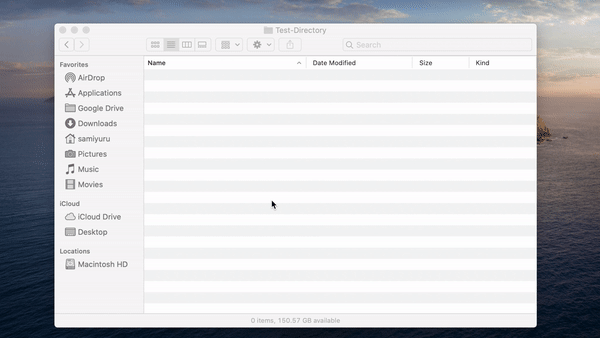
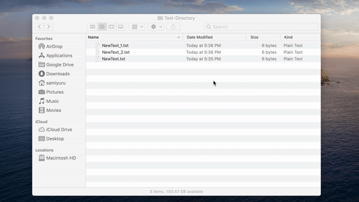

# MacOS Finder Custom Directory Right Click Menu

This application allows you to add custom right click menu items to directories opened in MacOS Finder. 
Right click menu items can be added as shell scripts. 
The application comes with two script files inbuilt to create new text documents in the current directory to open terminal from the current directory.
The application has been tested to work on MacOS Catalina Version 10.15.2.

## Download the Application

You can build the application from the source code on MacOS using Xcode.

If you are looking for pre build application file that is ready to run, you can download the zipped binary application file from [here](http://google.com). 

## Using the Application

Using the application is very simple. 
Copy FinderMenu.app to your "/Applications" directory. 
Run the FinderMenu.app once from the "/Applications" directory in your system to setup right click menu items.

When you run FinderMenu.app once, the application will take the following steps to setup the right click menu items.

* Install a launch agent to serve the custom right click menu items.
* Install a Finder extension to include custom right click menu items in the Finder.
* Create "~/FinderMenu" directory to place custom right click menu scripts.

Right click menu service in FinderMenu.app automatically starts with your system. 
Because of that you do not have to run FinderMenu.app ever again unless you do not want to make changes to the menu item scripts.
However, FinderMenu.app should always be present in your "/Applications" directory for the menus to work.

Following gif shows how the provided "New Text File Here" menu item works.

The next gif shows how the provided "Open Terminal Here" menu item works.

## Adding Custom Menu Items

Adding a new right click menu item is as simple as creating a shell script in the "~/FinderMenu" directory.
The shell script should accept the path to the directory as the first argument when running the script.
File name of the script file becomes the menu item name in the right click menu.
When the menu item is clicked, the script is executed with the directory path as the first argument.
You can refer to the given scripts in "~/FinderMenu" for examples.

## Uninstall the Application

You can take the following steps if you need to completely uninstall the application form your system.

* Delete the FinderMenu.app from "/Applications" directory.
* Delete the "~/FinderMenu" directory.
* Disable the finder extension by gong to "System Preferences > Extensions > All" and disabling the FinderMenu item.
* Remove the launch agent by deleting "~/Library/LaunchAgents/com.samiyuru.findermenu-service.plist"

## Credits

The icon used in the application is a modified version of an icon made by [Freepik](https://www.flaticon.com/authors/freepik) from [www.flaticon.com](https://www.flaticon.com). 

## License

Copyright &copy; Samiyuru Menik 2020.

You are permitted to use this application and source code for personal or commercial use. 
You are not allowed to redistribute this application or any of its content. 
But, you are allowed to redistribute this application to others by pointing them to this web location.
If you modify this application you are allowed to use the modified version personally on your own but you are not allowed to redistribute the modified version.

THE SOFTWARE IS PROVIDED "AS IS", WITHOUT WARRANTY OF ANY KIND, EXPRESS OR IMPLIED, INCLUDING BUT NOT LIMITED TO THE WARRANTIES OF MERCHANTABILITY, FITNESS FOR A PARTICULAR PURPOSE AND NONINFRINGEMENT. IN NO EVENT SHALL THE AUTHORS OR COPYRIGHT HOLDERS BE LIABLE FOR ANY CLAIM, DAMAGES OR OTHER LIABILITY, WHETHER IN AN ACTION OF CONTRACT, TORT OR OTHERWISE, ARISING FROM, OUT OF OR IN CONNECTION WITH THE SOFTWARE OR THE USE OR OTHER DEALINGS IN THE SOFTWARE.

